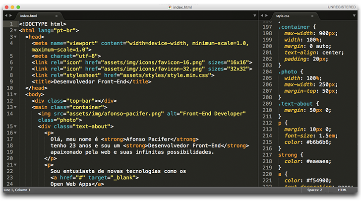
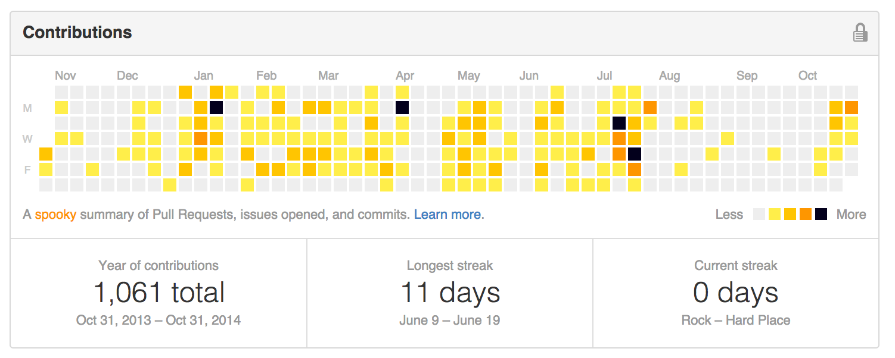

#Pumpkin
> A halloween theme, inspired on [Github Halloween Themed Contribution Graph.](#credits)

##Table of contents
- [Sublime Text](#sublime-text)
- [Color Palette](#color-palette)
- [Contributing](#contributing)
- [Credits](#credits)
- [Licence](#licence)

##Sublime Text

###Install using Package Control
*soon*

###Manually install
*1 - Clone this repository*

    $ git clone https://github.com/afonsopacifer/pumpkin.git

*2 - Take the pumpkin.tmTheme*

*3 - Open Sublime text and click on Preferences -> Browse Packages*

*4 - Then put the pumpkin.tmTheme there*

*5 - Now you should be able to select pumpkin theme by browsing Preferences -> Color Scheme -> pumpkin*

##Color Palette
Color |Palette|Hex
--------|------|------|------
 | Foreground |#eeeeee
 | String |#ffee4a
 | Function name,Function argument and Library class/type|#ffc501
 | Tag name and keywords|#fe9600
 | Background |#03001c
 | Tag attribute,Library function and Built-in constant |#1fb8c0
 | Comment |#7E978D

##Contributing
You want to help? read the [contributing guide.](contributing.md)

##Credits
*Logo by [Rodrigo Mellos](http://rodrigomellos.com/)*

*Project inspired by [@zenorocha's](https://github.com/zenorocha/) [Dracula Theme](https://github.com/zenorocha/dracula-theme) and [@raphamorim's](https://github.com/raphamorim/) [Lucario](https://github.com/raphamorim/lucario).*

*Color palette inspired by:*

*Github Halloween Themed Contribution Graph.*

##Licence
[MIT Licence](licence.md) © Afonso Pacifer
